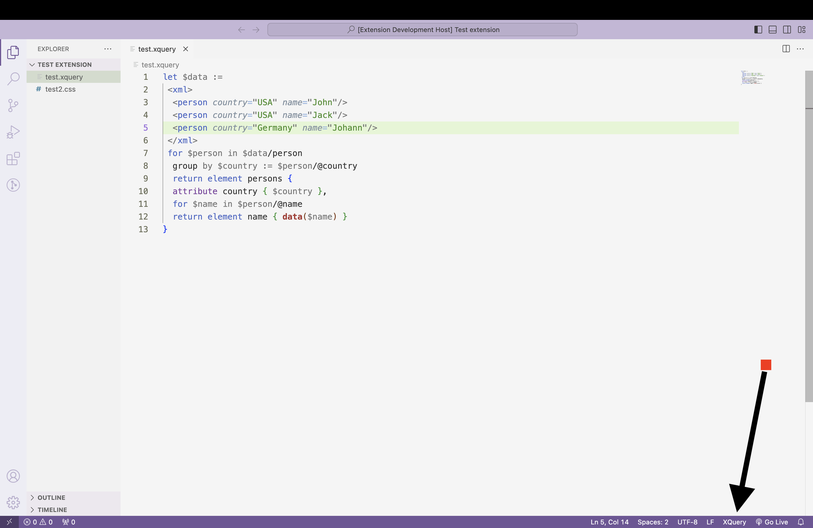

# Preety Xquery

"Pretty XQuery" is a dedicated Visual Studio Code extension designed to format and enhance the presentation of XQuery and XML code. Tailored for effortless integration within the VS Code environment, it facilitates the easy beautification of XQuery and XML code for improved readability and aesthetics during development.

---

## Feature

This extension provides the basic formatting of the Xquery and XML code.

## Requirements

There is not any specific requirement to run this extension, You'll just need to check if VS code automatically detects the code in XQuery or XML if it does then don't do anything but if it does not detect the code is in XQuery or XML format then follow the below steps.

1. Check the language mode in `Status Bar` of VS code.

2. Click on it, and a window will open type the Xquery or XML and select the language.

   That's it. All set.

   
   
## Extension Settings

This extension contributes the following settings:

* `query-formatter.enableFeature`: Enable/disable this extension.

## Release Notes

The initial release of Pretty Xquery

### 0.0.1

---

 Developed with ❤️ by Harshit 

 

 **Enjoy!** 

